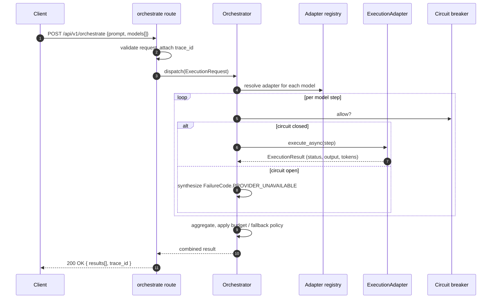

import { Aside, Card, CardGrid } from '@astrojs/starlight/components';

GraceKelly is a thin FastAPI orchestrator that fans a single user prompt
out to one or more execution adapters and returns either a structured
multi-model result (`/api/v1/orchestrate`) or a streamed best-of-N
selection (`/api/v1/smart`). The app shell stays small — heavy lifting
happens inside the adapters.

## Top-level modules

<CardGrid>
  <Card title="App entry" icon="rocket">
    `src/gracekelly/main.py` — `app_factory()` builds the FastAPI app,
    wires routers, mounts middleware, and exposes `/healthz/ready` and
    `/api/metrics`. `uvicorn` binds it to `:8011` by default.
  </Card>
  <Card title="API routes" icon="document">
    `src/gracekelly/api/routes/` — one file per surface
    (smart, orchestrate, debate, consensus, batch, compare, pipeline,
    stream, models, analytics, health, health_detailed). The
    [routes catalog](/GraceKelly/architecture/routes/) is auto-generated.
  </Card>
  <Card title="Adapter registry" icon="puzzle">
    `src/gracekelly/adapters/__init__.py` re-exports the concrete
    `ExecutionAdapter` implementations. `adapters/api/` holds HTTP-API
    backends; `adapters/browser/` holds the Playwright-driven Perplexity
    proxy; `adapters/dry_run.py` is the in-process simulator. The
    [adapter catalog](/GraceKelly/architecture/adapters/) is auto-generated.
  </Card>
  <Card title="Smart vs orchestrate" icon="random">
    `src/gracekelly/core/orchestrator.py` and the `smart`/`smart_v2`
    routes pick either fan-out (orchestrate) or routed best-of-N (smart),
    apply circuit-breaker / budget / fallback policies, and assemble the
    final `ExecutionResult`.
  </Card>
  <Card title="Health & metrics" icon="approve-check">
    `src/gracekelly/api/routes/health.py` and `health_detailed.py` expose
    readiness probes; `health_expose_details` env flag gates internal
    detail. Prometheus metrics are mounted at `/api/metrics`.
  </Card>
  <Card title="Configuration" icon="setting">
    `src/gracekelly/config.py` — frozen `Settings` dataclass loaded from
    `GRACEKELLY_*` env vars (with `.env` autoload outside pytest).
    Validated at startup. The
    [configuration matrix](/GraceKelly/architecture/config/) is auto-generated.
  </Card>
</CardGrid>

## Lifecycle of a `POST /api/v1/orchestrate` request

The async path uses `execute_async` so multiple adapters can run
concurrently. The browser adapter delegates blocking Playwright calls to
a dedicated `ThreadPoolExecutor` to keep the FastAPI event loop free.

## Data stores & runtime dependencies

| Store / dependency | Used by | Notes |
| --- | --- | --- |
| Postgres (or in-memory) | task store, run history | `GRACEKELLY_STORAGE_BACKEND` selects backend; pool tunables under `GRACEKELLY_POSTGRES_POOL_*` |
| Redis (optional) | rate limiter | enabled when `GRACEKELLY_REDIS_URL` is set; falls back to local token bucket |
| Chromium profile dir | `PerplexityBrowserAdapter` session | path from `GRACEKELLY_BROWSER_PROFILE_DIR`; runtime artifact, gitignored |
| Playwright threadpool | browser adapter | isolates blocking calls so the async event loop stays responsive |
| Browser circuit breaker | `PerplexityBrowserAdapter` | `GRACEKELLY_BROWSER_CIRCUIT_BREAKER_*` env vars; 3 failures × 60 s default |
| Browser session manager | `PerplexityBrowserAdapter` | reset on exception; cold-start navigation budget ~30 s |
| Sentry / OTel | observability | gated by `GRACEKELLY_SENTRY_DSN` / `GRACEKELLY_OTEL_ENDPOINT` |

<Aside type="note" title="Out of scope">
  Documenting Perplexity Pro internals or terms of service. The site
  describes how GraceKelly orchestrates calls; it does not endorse or
  publish anything about Perplexity's proprietary surface. Live
  Playwright / Perplexity sessions are not embedded here — the docs
  build runs on a Linux GitHub Actions runner without a Chromium binary.
</Aside>
